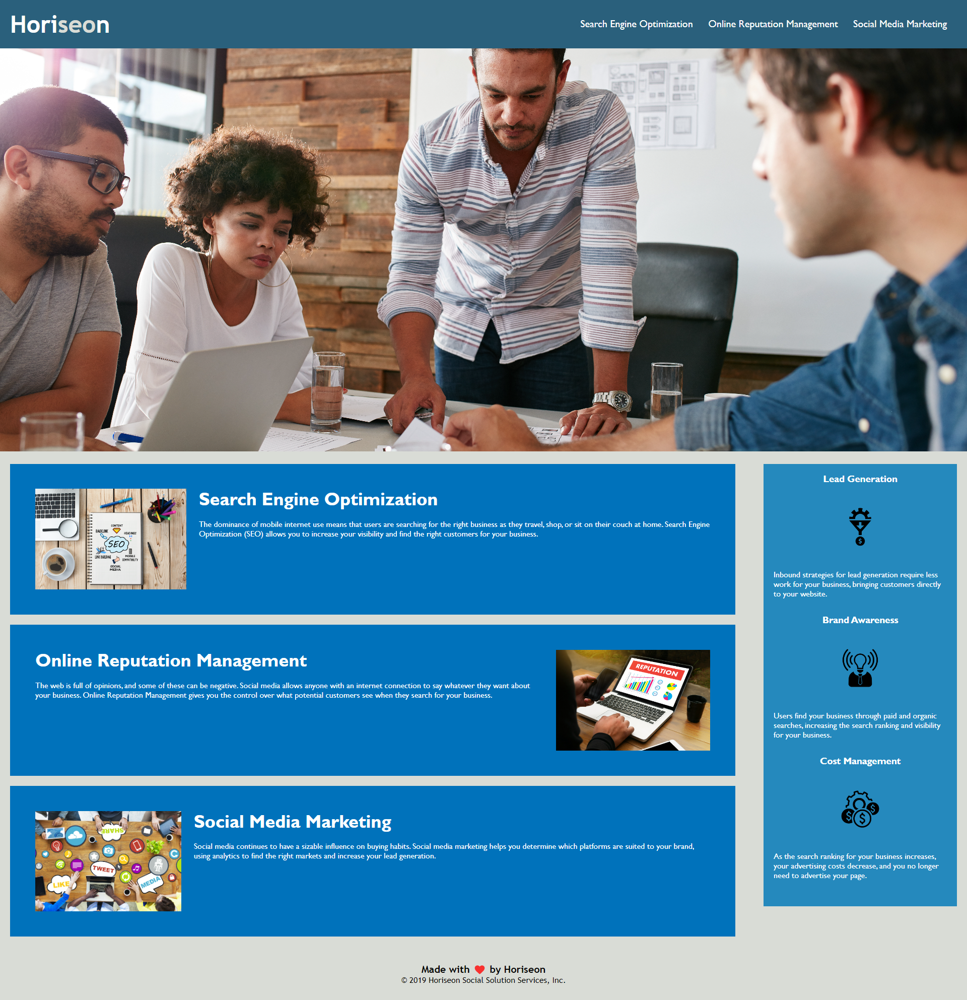

# Challenge 1 Horiseon.

## Table of Contents

- [Challenge 1 Horiseon.](#challenge-1-horiseon)
  - [Table of Contents](#table-of-contents)
  - [Description](#description)
  - [Resources](#resources)
  - [Visuals](#visuals)
  - [Authors and Acknowledgments](#authors-and-acknowledgments)

## Description

The Challenge one assignment tasked us with optimizing as well as enhancing the SEO (search engine optimization). 

This was accomplished by removing DIV tags and introducing Semantic tags into the HTML, introducing alt tags to all images, as well as cleaning us the style.css to appropriately match the mock up while optimizing the sheet. 

## Resources

- [LIVE SITE](https://jklaver91.github.io/Challenge1/)

- [Repository](https://github.com/Jklaver91/Challenge1)

## Visuals

## Authors and Acknowledgments

Code created my Bootcamp programming; code optimized by Justin Klaver.